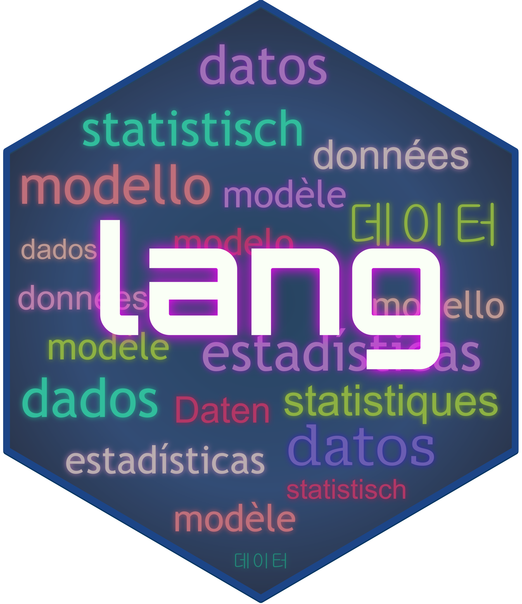

<!-- README.md is generated from README.Rmd. Please edit that file -->



# lang

<!-- badges: start -->

[](https://github.com/mlverse/lang/actions/workflows/R-CMD-check.yaml)
[](https://app.codecov.io/gh/mlverse/lang?branch=main)
<!-- badges: end -->

Use an **LLM to translate a function’s help documentation on-the-fly**.
`lang` overrides the `?` and `help()` functions in your R session. If
you are using RStudio or Positron, the translated help page will appear
in the usual help pane.

If you are a package developer, `lang` helps you translate your
documentation, and to include it as part of your package. `lang` will
use the same `?` override to display your translated help documents.

## Installation

To install the GitHub version of `lang`, use:

``` r
install.packages("pak")
pak::pak("mlverse/lang")
```

## Using `lang`

If you have not used `mall` yet, then the first step is to set it up.
Feel free to follow the instructions in that package’s [Get
Started](https://mlverse.github.io/mall/#get-started) page. Setting up
your LLM and `mall` should be a one time process.

On an every day R session, you’ll just need to load `lang` and then tell
it which model to run using `llm_use()`:

``` r
library(lang)

llm_use("ollama", "llama3.2", seed = 100)
```

After that, simply use `?` to trigger and display the translated
documentation. During translation, `lang` will display its progress by
showing which section of the documentation is currently translating:

``` r
> ?lm
Translating: Title
```

If your environment is set to use the Spanish language, the help pane
should display this:


R enforces the printed name of each section, so they cannot be
translated. So titles such as Description, Usage and Arguments will
always remain untranslated.

### How it works

The language that the help documentation will be translated to, is
determined by one of the following two environment variables. In order
of priority, the variables are:

1.  `LANGUAGE`
2.  `LANG`

It is likely that your `LANG` variable already defaults to your locale.
For example, mine is set to: `en_US.UTF-8` (That means English, United
States). For someone in France, the locale would be something such as
`fr_FR.UTF-8`. Llama3.2, recognizes these UTF locales, and using `lang`,
calling `?` will result in translating the function’s help documentation
into French.

It uses the `mall` package as the integration point with the LLM. Under
the hood, it runs `llm_vec_translate()` multiple times to translate the
most common sections of the help documentation (e.g.: Title,
Description, Details, Arguments, etc.). If `lang` determines that your
environment is set to use English, it will simply display the original
documentation.

### Considerations

#### Translation is not perfect

As you can imagine, the quality of translation will mostly depend on the
LLM being used. This solution is meant to be as helpful as possible, but
acknowledging that at this stage of LLMs, only a human curated
translation will be the best solution. Having said that, I believe that
even an imperfect translation could go a long way with someone who is
struggling to understand how to use a specific function in a package,
and may also struggle with the English language.

#### Debug

If the original English help page displays, check your environment
variables:

``` r
Sys.getenv("LANG")
#> [1] "en_US.UTF-8"
Sys.getenv("LANGUAGE")
#> [1] ""
```

In my case, `lang` recognizes that the environment is set to English,
because of the `en` code in the variable. If your `LANG` variable is set
to `en_...` then no translation will occur.

If this is your case, set the `LANGUAGE` variable to your preference.
You can use the full language name, such as ‘spanish’, or ‘french’, etc.
You can use `Sys.setenv(LANGUAGE = "[my language]")`, or, for a more
permanent solution, add the entry to your your .Renviron file
(`usethis::edit_r_environ()`).
